# Aeonith

**Buy together. Pay on proof.**

Your AI agent pools buyers who want the same kind of thing from the same seller, makes sellers' AI agents compete with **sealed bids**, and lets **PayPal hold the money** until the deal is delivered. Alone, you get competing sealed quotes and pay only on proof. Together, you also get the fleet price.

Built for the [PayPal AI Hackathon 2026](https://paypalaihackathon.devpost.com/) with **PayPal** (Orders v2, Payments v2, Payouts v1, Vault v3, JS SDK, Webhooks) and **AI** (NVIDIA Nemotron for text and vision, AI agents on both sides of every deal). **Sandbox only: no real money moves.**

| | |
|---|---|
| **Live app** | https://aeonith.onrender.com (PayPal sandbox, hosted on Render) |
| **Demo video** (2:56) | [[YouTube URL]] |
| **Repo** | https://github.com/ashfaque-rifaye/aeonith (MIT) |
| **Try it as a judge** | [Judge's guide](#try-it-judges-guide) · sandbox buyer below |

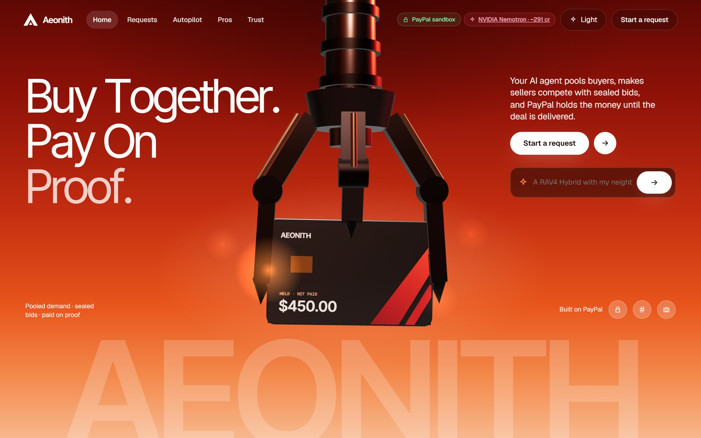

---

## Contents
1. [The problem](#the-problem)
2. [What Aeonith does](#what-aeonith-does)
3. [Why it only works on PayPal](#why-it-only-works-on-paypal)
4. [Architecture](#architecture)
5. [Use case 1: buy a car together](#use-case-1-buy-a-car-together-or-any-product)
6. [Use case 2: hire a pro, pay on proof](#use-case-2-hire-a-pro-pay-on-proof)
7. [Use case 3: Autopilot for emergencies](#use-case-3-autopilot-for-home-emergencies)
8. [How PayPal is used, call by call](#how-paypal-is-used-call-by-call)
9. [How AI is used](#how-ai-is-used)
10. [Platform integrations](#platform-integrations-ag-grid-bryntum-channel3-apimatic-render)
11. [Trust and safety design](#trust-and-safety-design)
12. [Try it (judge's guide)](#try-it-judges-guide)
13. [Run it locally](#run-it-locally) · [Deploy on Render](#deploy-on-render)
14. [Project structure](#project-structure) · [Tests](#tests)
15. [Honest limits](#honest-limits) · [References](#references)

---

## The problem

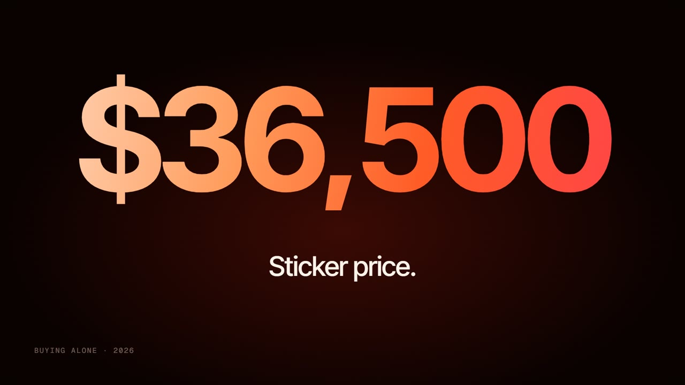

Small buyers pay sticker price, alone, and often up front to someone they don't know.

- The FTC logged **81,925 home-improvement fraud reports in 2024** ([FinanceBuzz, from FTC Consumer Sentinel data](https://financebuzz.com/contractor-scams)). Home repair was the **#1 consumer complaint of 2025** in Tennessee ([NewsTalk 98.7](https://newstalk987.com/?p=1104138)), and lost deposits are a top issue ([WWIS](https://wwisradio.com/wisconsin-consumers-top-complaints-of-2025)).
- Deposits are risky enough that the law steps in: California caps contractor down payments at **$1,000 or 10%, whichever is less** ([CSLB](https://www.cslb.ca.gov/Resources/IndustryBulletins/2022/Industry_Bulletin_Progress_Payment_Restrictions.pdf)).
- A single buyer gets one quote, often on the doorstep. Fleets and companies get volume pricing; neighbours who want the same car or the same repair don't.
- AI shopping agents make it worse when they chat with sellers, because they leak what you'd pay ([2026 study](https://arxiv.org/abs/2604.26220)).

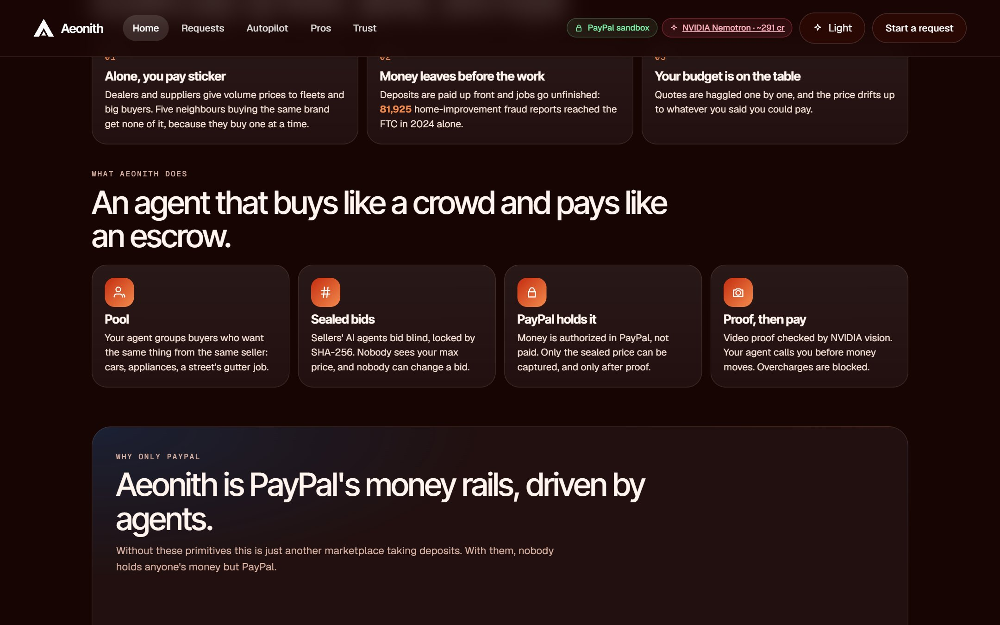

## What Aeonith does

One engine, three use cases:

| Use case | What happens | What the customer gets | PayPal under it |
|---|---|---|---|
| **1. Buy a car together** (or any product) | Neighbours who want Toyotas (different models) from one dealership pool. Each joins with a **$500 refundable deposit**. Dealers' AI agents seal **one fleet discount** for the whole group. | **8.7% off every model, about $2,926 per car** in the recorded run ($14,632 for five buyers). Anyone whose private max is below their model's price is released: **$0 charged**. | Deposit `AUTHORIZE` → capture at delivery, **void** for anyone priced out |
| **2. Hire a pro, pay on proof** | Licensed pros send sealed quotes (the agent phones pros who aren't on Aeonith yet; an outside pro's own agent bids through our SDK). You book the winner; PayPal holds **exactly the sealed price**. | Best licensed quote (**$44 below the top quote** in the run), money never paid up front, **overcharges blocked**, pros paid fast. | `AUTHORIZE` exact price → video proof → **capture** only the sealed price → **Payouts** |
| **3. Autopilot** | Save PayPal once with a budget. A leak sensor fires at 3 a.m.; Aeonith files the job, **holds money on the saved wallet with no login**, pros bid blind, and your agent calls. Nobody is sent until you say approve. | Help booked in minutes, not a flooded garage; spending capped; nothing moves without your yes. | **Vault v3** → merchant-initiated `AUTHORIZE` with `vault_id` |

## Why it only works on PayPal

- **Authorize now, capture later.** A hold is a real commitment the seller can see, but the buyer hasn't paid. That is what makes pooling safe and lets dealers bid on funded demand.
- **Partial capture + void.** Each buyer is charged their own price at most; anyone priced out is voided instantly. Capture can never exceed the sealed price.
- **Payouts to an email.** A recruited pro who isn't on any platform still gets paid the moment the proof passes.
- **Vault.** Autopilot can fund an emergency at 3 a.m. without a redirect, inside a budget the buyer approved once.
- **One trusted checkout.** Every approval happens in PayPal's own window, not ours.

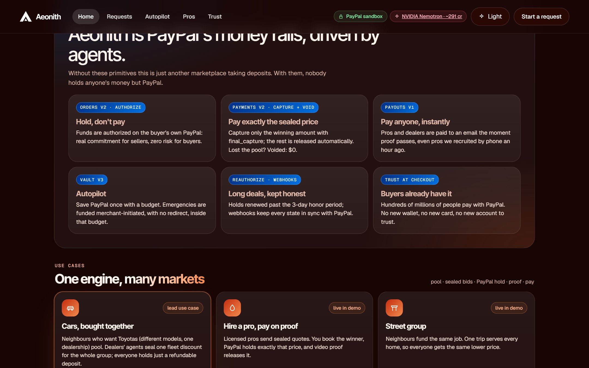

## Architecture

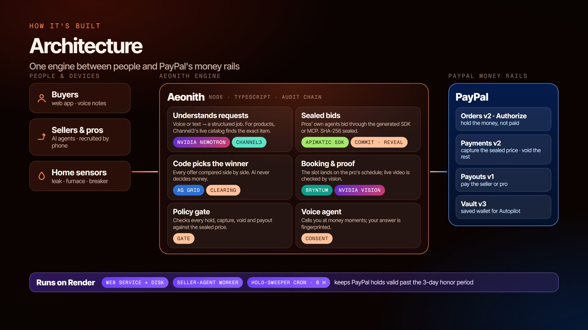

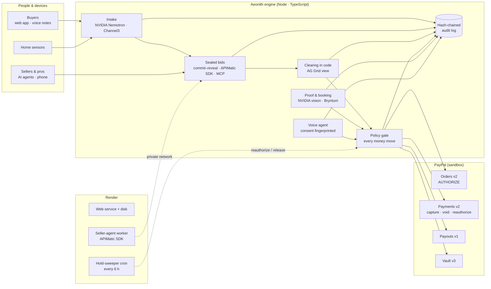
```mermaid
flowchart LR
  subgraph People["People & devices"]
    B[Buyers<br/>web app · voice notes]
    S[Sellers & pros<br/>AI agents · phone]
    H[Home sensors]
  end
  subgraph Engine["Aeonith engine (Node · TypeScript)"]
    I[Intake<br/>NVIDIA Nemotron · Channel3]
    C[Sealed bids<br/>commit–reveal · APIMatic SDK · MCP]
    K[Clearing in code<br/>AG Grid view]
    G[Policy gate<br/>every money move]
    P[Proof & booking<br/>NVIDIA vision · Bryntum]
    V[Voice agent<br/>consent fingerprinted]
    A[(Hash-chained<br/>audit log)]
  end
  subgraph PayPal["PayPal (sandbox)"]
    O[Orders v2<br/>AUTHORIZE]
    M[Payments v2<br/>capture · void · reauthorize]
    Y[Payouts v1]
    T[Vault v3]
  end
  B --> I --> C --> K --> G
  S --> C
  H --> I
  P --> G
  V --> G
  G --> O & M & Y & T
  I & C & K & G & P & V --> A
  subgraph Render["Render"]
    W[Web service + disk]
    X[Seller-agent worker<br/>APIMatic SDK]
    Z[Hold-sweeper cron<br/>every 6 h]
  end
  X -. private network .-> C
  Z -. reauthorize / release .-> G
```

**Design rule: AI advises, code decides money.** The model structures requests, writes pitches, checks promises and reads proof video. It never picks a winner and never calls PayPal. Clearing is deterministic code ([src/core/clearing.ts](src/core/clearing.ts)), and every PayPal call passes the policy gate ([src/core/policy.ts](src/core/policy.ts)).

---

## Use case 1: buy a car together (or any product)

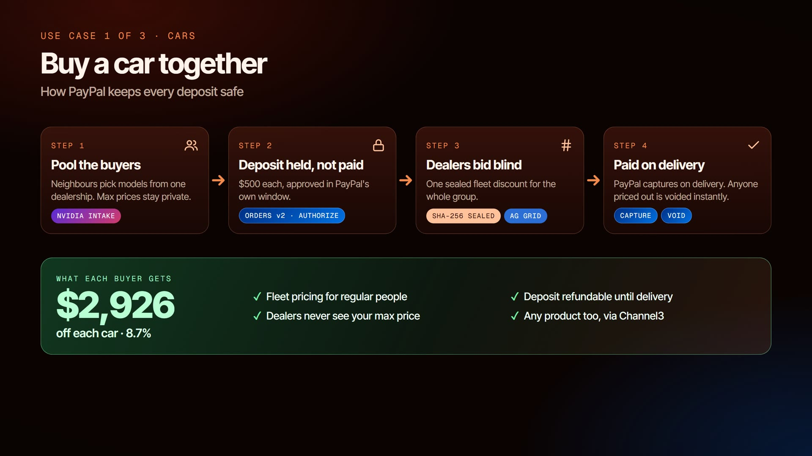

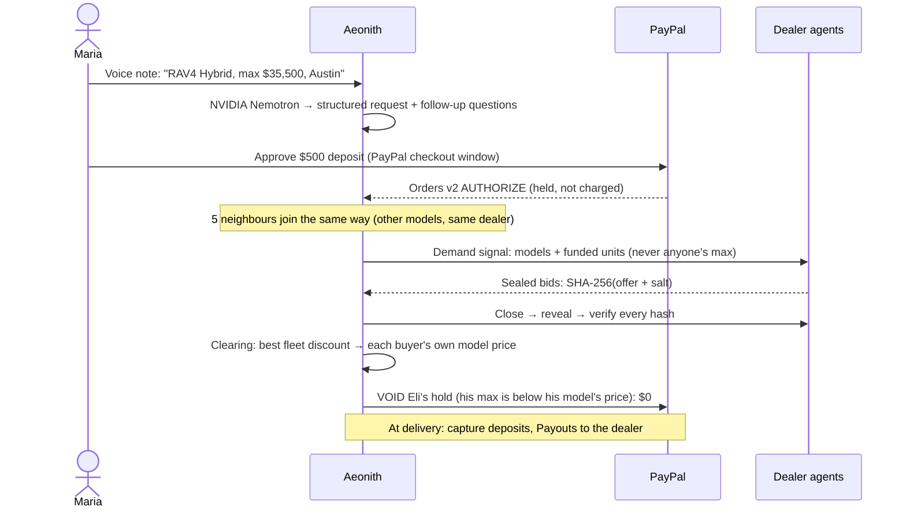
```mermaid
sequenceDiagram
  actor Maria
  participant A as Aeonith
  participant PP as PayPal
  participant D as Dealer agents
  Maria->>A: Voice note: "RAV4 Hybrid, max $35,500, Austin"
  A->>A: NVIDIA Nemotron → structured request + follow-up questions
  Maria->>PP: Approve $500 deposit (PayPal checkout window)
  PP-->>A: Orders v2 AUTHORIZE (held, not charged)
  Note over A: 5 neighbours join the same way (other models, same dealer)
  A->>D: Demand signal: models + funded units (never anyone's max)
  D-->>A: Sealed bids: SHA-256(offer + salt)
  A->>D: Close → reveal → verify every hash
  A->>A: Clearing: best fleet discount → each buyer's own model price
  A->>PP: VOID Eli's hold (his max is below his model's price): $0
  Note over A,PP: At delivery: capture deposits, Payouts to the dealer
```

| Pool of six, different models | Sealed fleet bids, opened together |
|---|---|
| 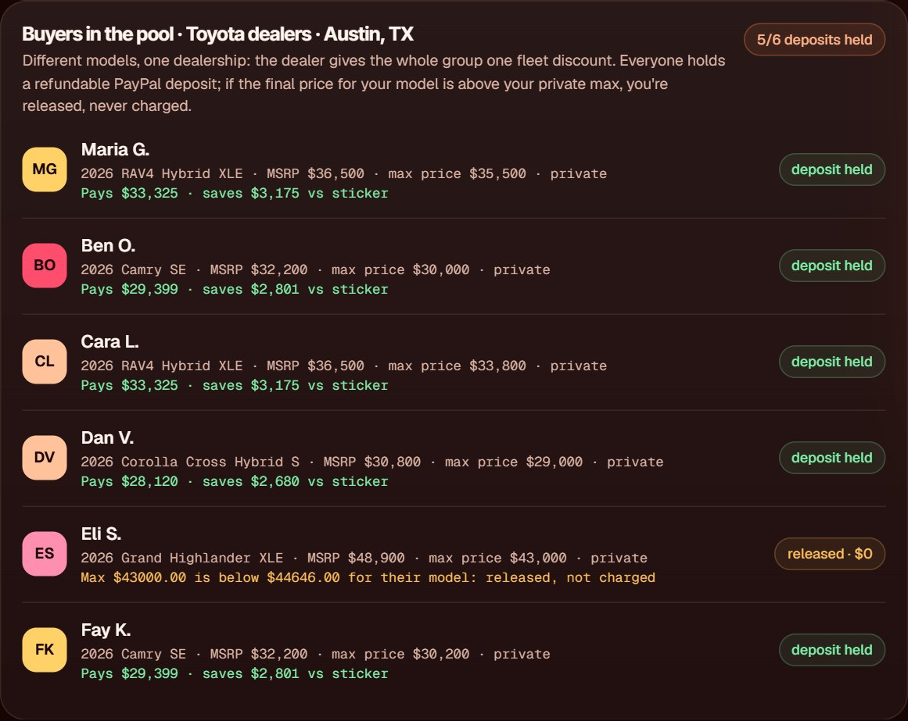 | 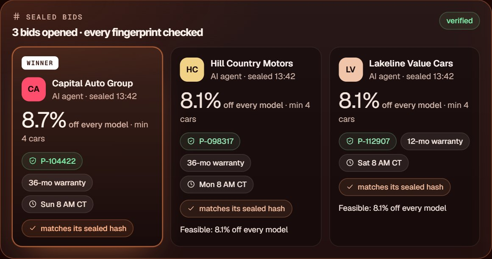 |

| What everyone saves | AG Grid: every dealer's offer, side by side |
|---|---|
| 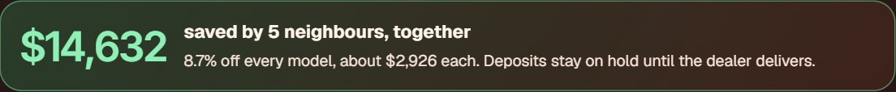 | 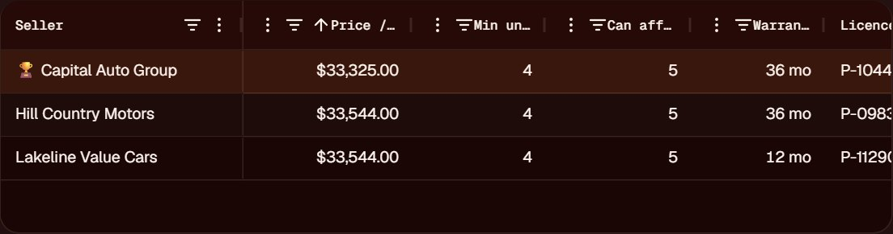 |

**Any product works the same way.** For goods, Channel3's live catalog finds the exact item the pool buys (e.g. eight parents and one Chromebook model):

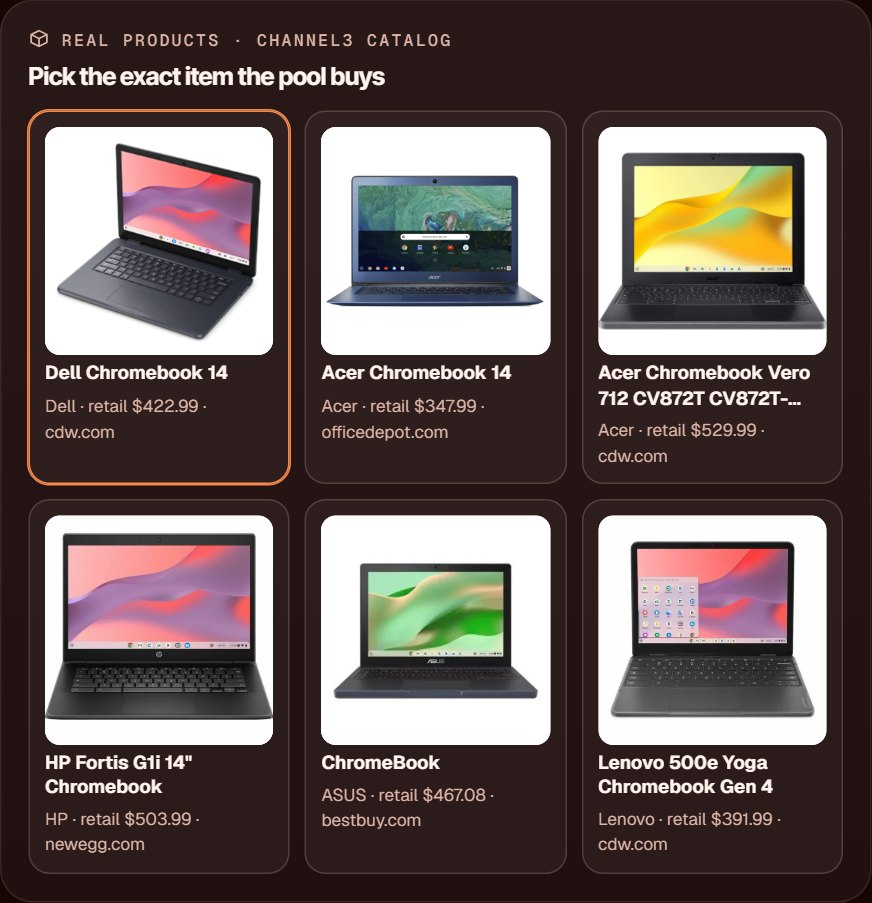

## Use case 2: hire a pro, pay on proof

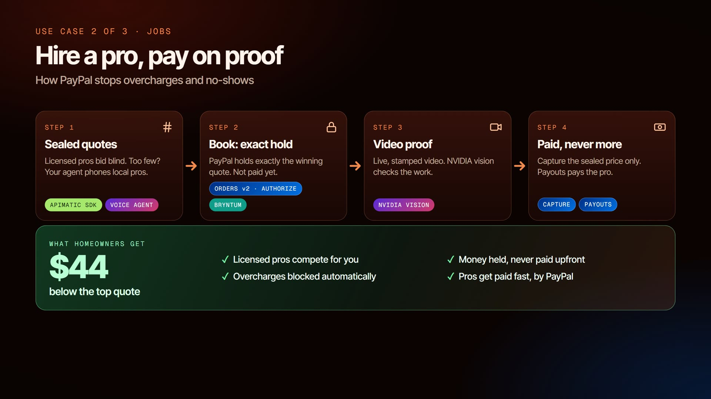

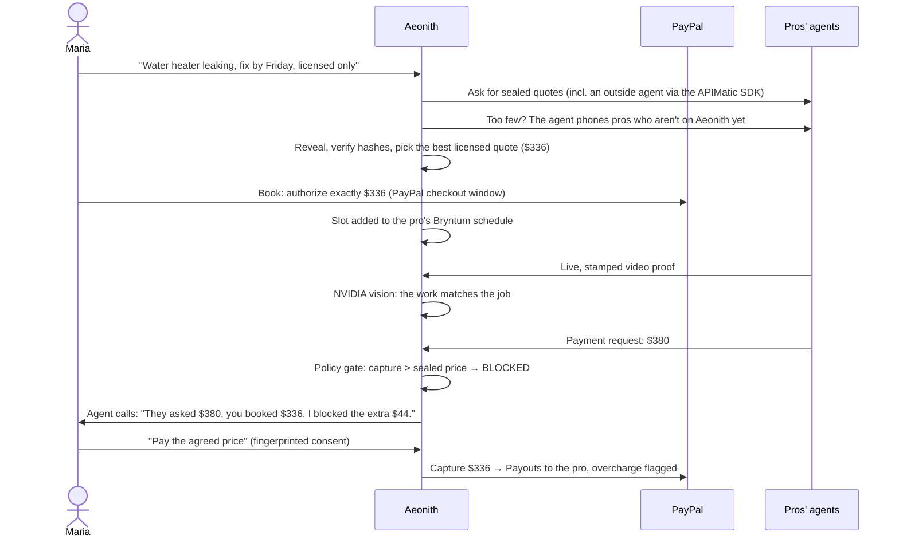
```mermaid
sequenceDiagram
  actor Maria
  participant A as Aeonith
  participant PP as PayPal
  participant Pro as Pros' agents
  Maria->>A: "Water heater leaking, fix by Friday, licensed only"
  A->>Pro: Ask for sealed quotes (incl. an outside agent via the APIMatic SDK)
  A->>Pro: Too few? The agent phones pros who aren't on Aeonith yet
  A->>A: Reveal, verify hashes, pick the best licensed quote ($336)
  Maria->>PP: Book: authorize exactly $336 (PayPal checkout window)
  A->>A: Slot added to the pro's Bryntum schedule
  Pro->>A: Live, stamped video proof
  A->>A: NVIDIA vision: the work matches the job
  Pro->>A: Payment request: $380
  A->>A: Policy gate: capture > sealed price → BLOCKED
  A->>Maria: Agent calls: "They asked $380, you booked $336. I blocked the extra $44."
  Maria->>A: "Pay the agreed price" (fingerprinted consent)
  A->>PP: Capture $336 → Payouts to the pro, overcharge flagged
```

| A pro's own agent bids through the APIMatic SDK | The booking on the pro's Bryntum schedule |
|---|---|
| 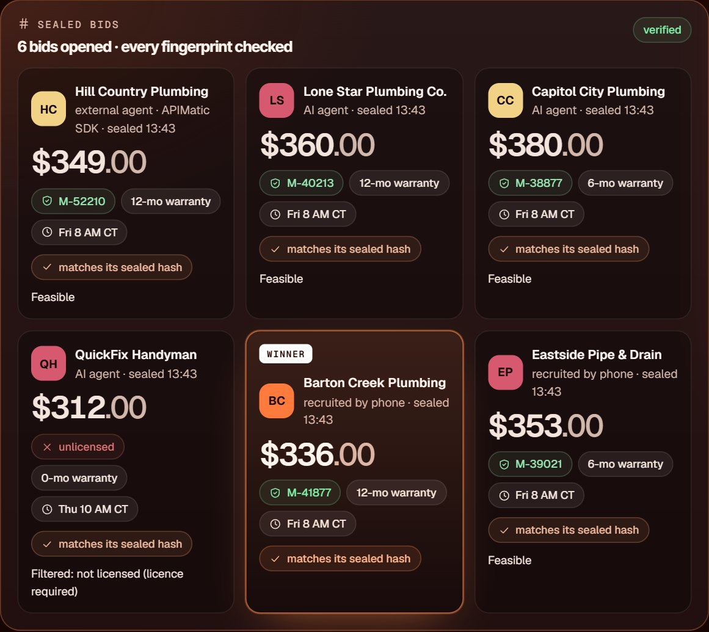 | 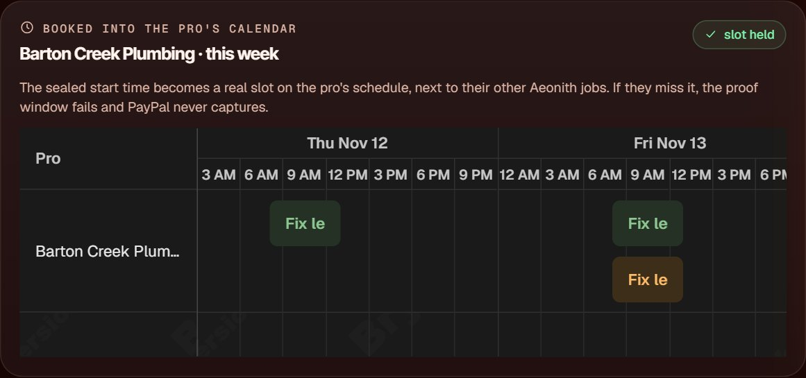 |

| NVIDIA vision checks the video proof | Settled on PayPal, overcharge on record |
|---|---|
| 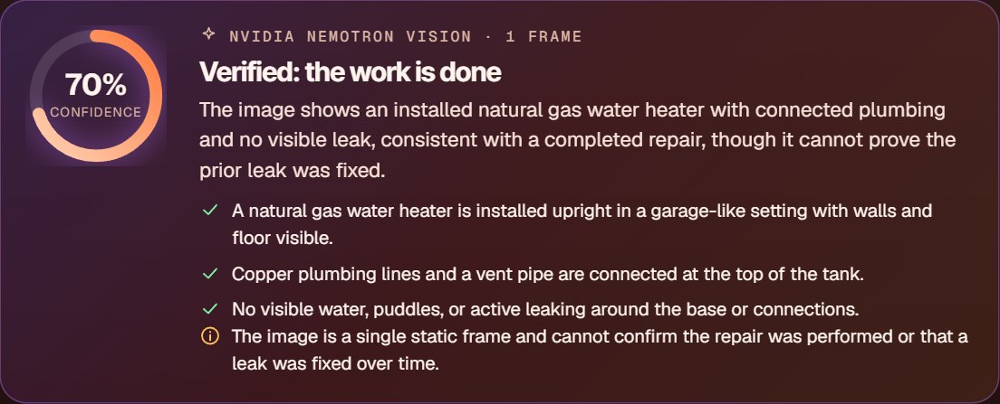 | 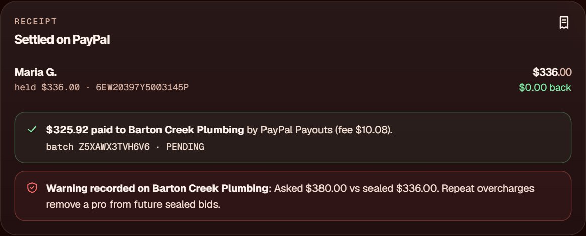 |

Every PayPal call is shown on the job's Activity timeline with its API and ID:

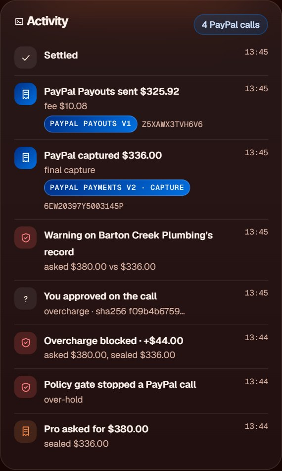

## Use case 3: Autopilot for home emergencies

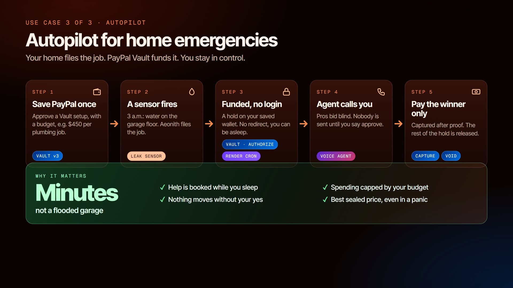

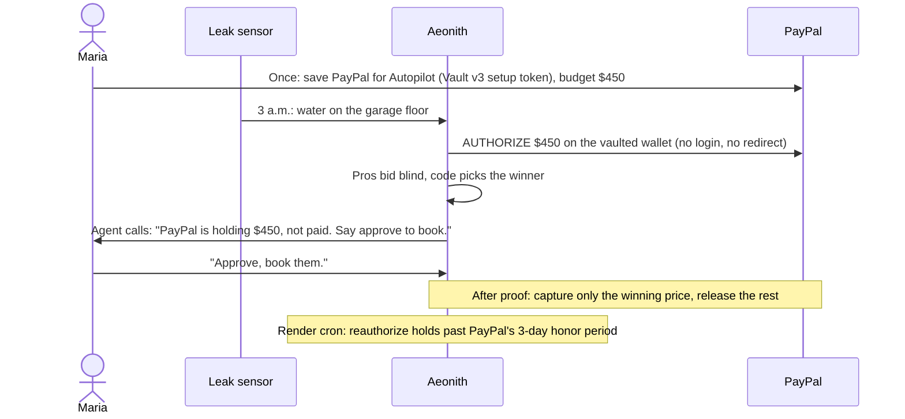
```mermaid
sequenceDiagram
  actor Maria
  participant H as Leak sensor
  participant A as Aeonith
  participant PP as PayPal
  Maria->>PP: Once: save PayPal for Autopilot (Vault v3 setup token), budget $450
  H->>A: 3 a.m.: water on the garage floor
  A->>PP: AUTHORIZE $450 on the vaulted wallet (no login, no redirect)
  A->>A: Pros bid blind, code picks the winner
  A->>Maria: Agent calls: "PayPal is holding $450, not paid. Say approve to book."
  Maria->>A: "Approve, book them."
  Note over A,PP: After proof: capture only the winning price, release the rest
  Note over A: Render cron: reauthorize holds past PayPal's 3-day honor period
```

| Autopilot: saved wallet + budget | A job filed and funded by the home |
|---|---|
| 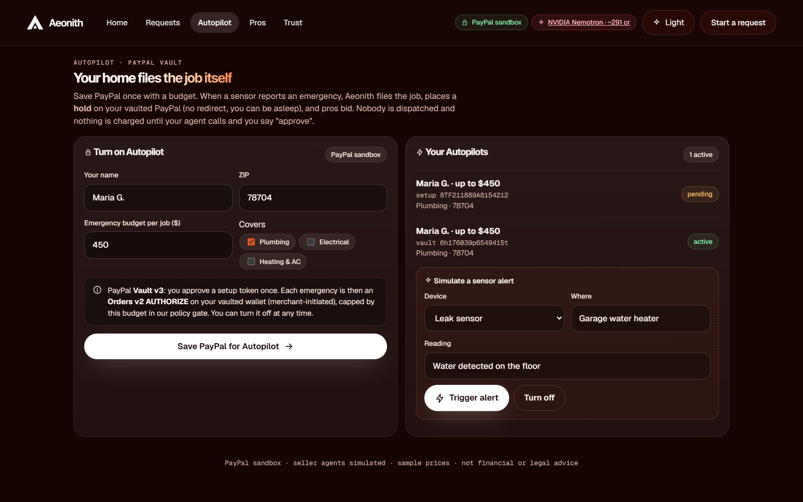 | 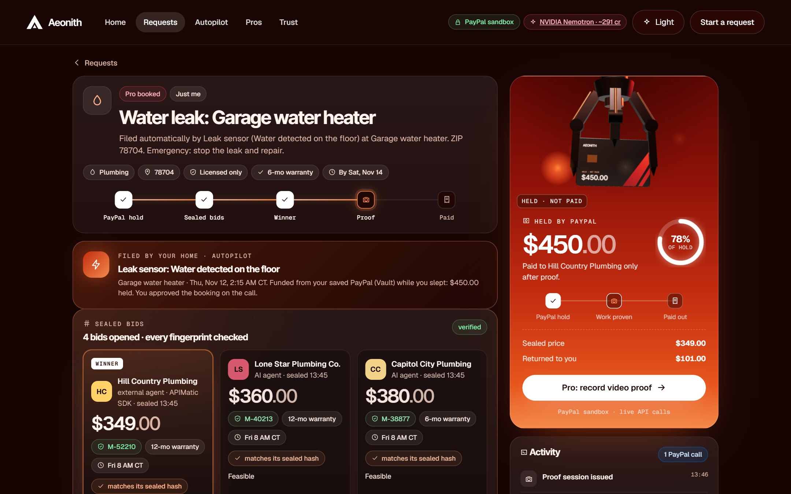 |

---

## How PayPal is used, call by call

| PayPal API | Where | When |
|---|---|---|
| **JS SDK** buttons (popup) | [public/app.js](public/app.js) `openPayPal` | Every buyer approval happens in PayPal's own window |
| **Orders v2** create with `intent: AUTHORIZE` | [src/paypal/client.ts](src/paypal/client.ts) `createAuthorizeOrder` | Car deposits, booking a pro (exact sealed price) |
| **Orders v2** authorize | `authorizeOrder` | After approval: the hold is placed |
| **Payments v2** capture (partial, `final_capture`) | `captureAuthorization` | After proof: only the sealed price, never more |
| **Payments v2** void | `voidAuthorization` | Buyers priced out, expired requests, declined jobs |
| **Payments v2** reauthorize | `reauthorize` | Holds older than the 3-day honor period (Render cron) |
| **Payments v2** refund | `refundCapture` | Disputes after capture |
| **Payouts v1** | `createPayout` | Pay the pro or dealer by email, minus the platform fee |
| **Vault v3** setup + payment tokens | `createVaultSetupToken`, `createPaymentToken` | Save PayPal once for Autopilot |
| **Orders v2** `AUTHORIZE` with `vault_id` | `authorizeWithVault` | A sensor funds a job, merchant-initiated |
| **Webhooks** + `verify-webhook-signature` | `verifyWebhook`, `POST /api/webhooks/paypal` | Authorization and capture events |
| `PayPal-Request-Id` | every call | Idempotency: retries never double-charge |

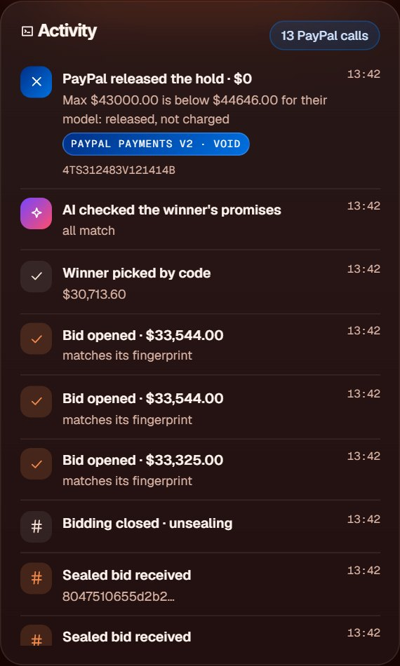

## How AI is used

**NVIDIA Nemotron** (`nvidia/nemotron-3.5-super-vl-120b-a12b`, text + vision) through the NVIDIA API catalog ([src/ai/agent.ts](src/ai/agent.ts)):

| Step | What the model does | Output is checked by |
|---|---|---|
| Intake | Voice note or text → a structured request (category, budget, deadline, licence…) | Zod schema |
| Follow-up questions | 2–3 questions that change the offers (trim, trade-in, access) | Zod schema |
| Seller agents | Each simulated pro or dealer agent writes its pitch | Price comes from its cost model, not the LLM |
| Promise check | Compares the winner's promises with the request | Shown, never decides |
| Video proof | Reads the stamped live frames: is this the job, finished? Observations, concerns, confidence | Verdict rule in code ([src/core/proof.ts](src/core/proof.ts)) |
| Voice agent | Calls you at money moments (script built from PayPal state, not the model) | Approval by phrase match, SHA-256 fingerprinted |

Every NVIDIA request is **metered** (tokens, latency, purpose, credits left) and shown on the Trust page. Claude (`claude-opus-5-5`) is supported as an alternative provider, and every AI step has a deterministic fallback, so the app runs without any key.

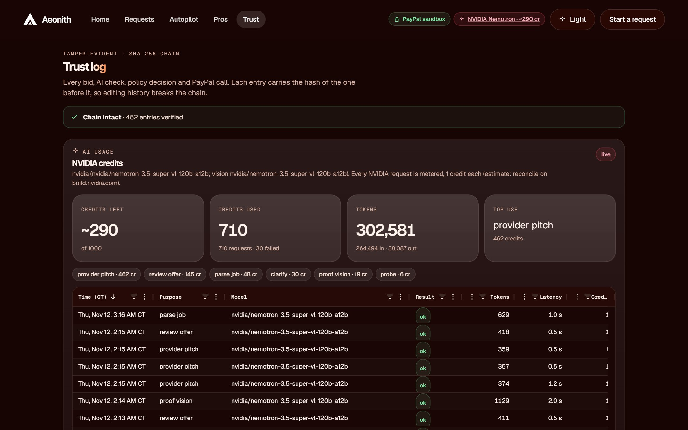

## Platform integrations (AG Grid, Bryntum, Channel3, APIMatic, Render)

Each one does a real job inside a use case:

| Platform | What it does in Aeonith | Code |
|---|---|---|
| **AG Grid Enterprise** | Under every winner: each seller's sealed offer side by side (price, minimum units, warranty, licence), so buyers can check the clearing. Also the Trust page's audit log (filters, row grouping) and AI usage grid. | [public/app.js](public/app.js) `mountBidGrid`, `mountTrustGrids` |
| **Bryntum Scheduler** | When a pro is booked, the sealed start time becomes a slot on the pro's schedule, next to their other Aeonith jobs; the Pros page shows every booked pro. | `mountProSchedule`, `mountScheduler` |
| **Channel3** | Live product search for buy-together pools: real products, images, retail prices; the pool buys that exact item. | [src/catalog/channel3.ts](src/catalog/channel3.ts) |
| **APIMatic** | [docs/openapi.yaml](docs/openapi.yaml) generates the TypeScript SDK in [sdk/typescript](sdk/typescript). Sellers' own agents bid through it: the MCP server ([src/mcp.ts](src/mcp.ts)) and the stand-alone seller agent ([scripts/seller-agent.ts](scripts/seller-agent.ts)) seal with SHA-256, reveal after close, and read the result, all via the SDK. | [src/agents/sellerSdk.ts](src/agents/sellerSdk.ts) |
| **Render** | [render.yaml](render.yaml): the **web service** (with a persistent disk), a **background worker** running an outside pro's SDK bidding agent over Render's private network, and a **cron job every 6 hours** that reauthorizes PayPal holds past the 3-day honor period and releases holds on requests that closed with no winner. | [scripts/sweep.ts](scripts/sweep.ts), `POST /api/admin/sweep`, [scripts/render-env.mjs](scripts/render-env.mjs) |

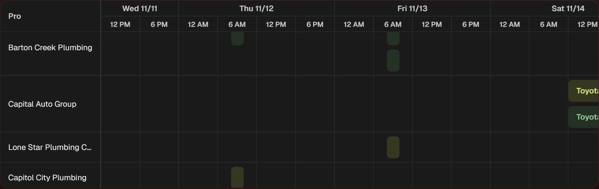

## Trust and safety design

- **Commit–reveal sealed bids** ([src/core/commit.ts](src/core/commit.ts)): sellers send only `SHA-256(canonical offer | salt)`. Nobody, Aeonith included, can read a bid early, and a revealed bid can't change.
- **No field for your limit**: the demand signal sellers see has no field that could carry a buyer's max price ([src/protocol/schema.ts](src/protocol/schema.ts)), and a test proves it.
- **Policy gate** ([src/core/policy.ts](src/core/policy.ts)) in front of every PayPal call: holds within the cap, capture ≤ the sealed price ≤ the hold, only after proof or your consent, payouts only to the winner.
- **Video proof**: frames stamped with a live session that exists only from that moment and expires in 2 minutes; reused frames are detected by fingerprint.
- **Fingerprinted consent**: every "approve" or "pay the agreed price" is hashed into the audit chain.
- **Hash-chained audit log** ([src/core/audit.ts](src/core/audit.ts)): editing any past entry breaks the chain; the Trust page verifies it.
- **Hold hygiene**: the Render cron reauthorizes old holds and releases stale ones, so no buyer stays reserved for nothing.
- **Secrets** live in environment variables only; the PayPal client secret never reaches the browser. See [SECURITY.md](SECURITY.md).

---

## Try it (judge's guide)

Open **https://aeonith.onrender.com** and sign in to PayPal (in PayPal's own window) with the sandbox buyer:

| Role | Sandbox account |
|---|---|
| **Buyer** (approve holds) | `sb-nsxra53758944@personal.example.com` · password: [[sandbox password]] |
| Aeonith (merchant of record) | `sb-llat153656226@business.example.com` |
| Pro (receives Payouts) | `sb-rds43c53656224@business.example.com` |

**Hire a pro (≈3 min):**
1. **Start a request → Hire a pro**, type or say the job, **Let the agent understand it**, then **Ask for sealed quotes**. One quote comes from Hill Country Plumbing's own agent (Render worker, APIMatic SDK).
2. Optionally **Call local pros who aren't on Aeonith yet** and watch the calls.
3. **Open the sealed quotes**, then **Book with PayPal** and approve in PayPal's window. The slot appears on the pro's Bryntum schedule.
4. **Pro: record video proof** (camera, or upload a photo/video), then **Stop & verify**.
5. In the pro's app, request more than the quote (e.g. $380): the gate blocks it and your agent calls. Tap **Pay the agreed price**.
6. Check the **Activity** timeline (authorize, capture, Payouts, overcharge flag) and the **Trust** page.

**Buy a car together:** **Start a request → Buy something together**, describe the car, pick a model, **Start the pool** and join with the **$500 PayPal deposit**. Add neighbours with the join form, **Ask dealers for sealed offers**, then **Open the sealed offers**: see the fleet discount, everyone's savings and the AG Grid table.

**Autopilot:** **Autopilot → Save PayPal for Autopilot** (approve in PayPal), then **Trigger alert** on the sensor form and answer your agent's call.

## Run it locally
```bash
npm install
npm run build:sdk          # builds the APIMatic-generated SDK (sdk/typescript)
cp .env.example .env       # sandbox PAYPAL_CLIENT_ID / PAYPAL_CLIENT_SECRET, ADMIN_TOKEN; optional NVIDIA_API_KEY, CHANNEL3_API_KEY, AG_GRID_LICENSE_KEY
npm run dev                # http://localhost:3000
npm test                   # 20 tests
npm run sandbox:check      # confirms your PayPal sandbox keys work (prints no secrets)
npm run nvidia:check       # confirms the NVIDIA key and models, prints credits left
npm run demo               # with the server running: drives every flow end to end and fills the app with realistic jobs
npm run seller-agent       # an outside pro's agent that bids through the SDK
npm run mcp                # the Offer Protocol as an MCP server for any agent
```
Without sandbox credentials the app runs in a clearly labelled **SIMULATED PayPal** mode, for local development only.

## Deploy on Render
1. Render → **New → Blueprint** → this repo. [render.yaml](render.yaml) creates the web service (+ disk), the seller-agent worker and the hold-sweeper cron.
2. Put a Render API key in `.env` as `RENDER_API_KEY`, then `node scripts/render-env.mjs`: it copies the secret values from `.env` to the service, sets `APP_BASE_URL` and starts a deploy.

## Project structure
```
src/
  server.ts            Express API, PayPal return/webhook routes, Offer Protocol v1
  service.ts           the engine: requests, holds, bidding, award, proof, calls, payment requests, sweep
  core/                clearing · commit–reveal · policy gate · proof checks · audit chain
  paypal/              PayPal REST client (Orders, Payments, Payouts, Vault, Webhooks) + simulated mode
  ai/agent.ts          NVIDIA Nemotron / Claude: intake, follow-ups, pitches, promise and vision checks
  agents/              simulated sellers' agents + the APIMatic SDK seller client
  catalog/channel3.ts  Channel3 product search
  protocol/schema.ts   the demand signal sellers see (no field for buyer limits)
  mcp.ts               Offer Protocol as an MCP server
public/                the web app (vanilla JS, three.js claw, GSAP, AG Grid, Bryntum)
sdk/typescript/        APIMatic-generated TypeScript SDK (from docs/openapi.yaml)
scripts/               demo driver, seller agent, hold sweeper, Render env sync, checks
test/                  node:test suites
docs/                  design, use cases, OpenAPI spec, submission text, images
```

## Tests
`npm test` runs 20 tests: clearing (including multi-model fleet pools), commit–reveal, the policy gate, the audit chain, proof verdicts, reauthorization, quote-first booking with an overcharge, Autopilot with the Voice Agent and video proof.

## Honest limits
- The dealers and most pros in the demo are **simulated agents** (cost models plus AI-written pitches). The protocol is real and open: the outside SDK agent and any MCP agent bid the same way.
- Video proof shows **visible completion**, not workmanship quality. PayPal Purchase Protection and refunds still apply.
- In the demo Aeonith is the merchant of record and pays sellers with Payouts. Production would use PayPal's multiparty/platform onboarding.
- Sandbox only. Not legal or financial advice.

## References
- FTC fraud figure via [FinanceBuzz: contractor scams](https://financebuzz.com/contractor-scams) (FTC Consumer Sentinel, 2024)
- [NewsTalk 98.7: home repair, #1 complaint of 2025](https://newstalk987.com/?p=1104138) · [WWIS: Wisconsin's top complaints](https://wwisradio.com/wisconsin-consumers-top-complaints-of-2025)
- [CSLB: down-payment limits](https://www.cslb.ca.gov/Resources/IndustryBulletins/2022/Industry_Bulletin_Progress_Payment_Restrictions.pdf)
- [AI shopping agents leak willingness to pay (2026)](https://arxiv.org/abs/2604.26220)
- PayPal: [Orders v2](https://developer.paypal.com/docs/api/orders/v2/) · [Payments v2](https://developer.paypal.com/docs/api/payments/v2/) · [Payouts](https://developer.paypal.com/docs/api/payments.payouts-batch/v1/) · [Vault v3](https://developer.paypal.com/docs/api/payment-tokens/v3/) · [JS SDK](https://developer.paypal.com/sdk/js/)
- [NVIDIA API catalog](https://build.nvidia.com/) · [AG Grid](https://www.ag-grid.com/) · [Bryntum Scheduler](https://bryntum.com/products/scheduler/) · [Channel3](https://docs.trychannel3.com/) · [APIMatic](https://www.apimatic.io/) · [Render](https://render.com/docs/blueprint-spec)
- More: [Solution design](docs/SOLUTION_DESIGN.md) · [Use cases & PayPal revenue](docs/USE_CASES.md) · [Security](SECURITY.md) · [Hackathon notes](HACKATHON.md)

Visual direction was inspired by the "Daily Bank" fintech concept by Nixtio on Dribbble; all artwork and code here are original.

## License
[MIT](LICENSE)
